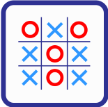

# AI_codes
These are some assignments that I had in my AI course in TY.

## Problem Statements
### N-Queen Problem
The N-queens puzzle is the problem of placing n queens on an n×n chessboard such that no two queens attack each other.How can N queens be placed on an NxN chessboard so that no two of them attack each other?   

### TIC TAC TOE (Non-AI Technique)
Play Tic Tac Toe with the computer. The implementation has been done using Non-AI Technique that is without using heuristics.

